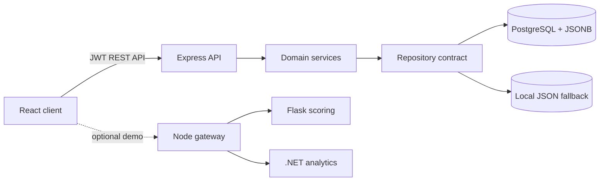

# ExamApp

**A professional full-stack examination platform for teachers and students.**

ExamApp covers the full assessment lifecycle: secure role-based access, question authoring, publishing, timed student attempts, server-side scoring, result analytics, hybrid PostgreSQL/JSONB persistence, automated tests, Docker, microservices and CI/CD.

## Submission links

Verified account-owned project links:

- GitHub: <https://github.com/AwsZoabi/ExamApp>
- Live client demo: <https://awszoabi.github.io/ExamApp/>
- API health: `REPLACE_ME_API_HEALTH_URL`
- Kanban board: `REPLACE_ME_KANBAN_URL`
- GitHub Actions: <https://github.com/AwsZoabi/ExamApp/actions>
- Demonstration video: `REPLACE_ME_VIDEO_URL`

The complete link/evidence checklist is in [SUBMISSION.md](SUBMISSION.md).

## Highlights

### Teacher experience

- Dashboard with exam, submission and performance metrics
- Exam creation/editing with dynamic questions and answer options
- Draft, open and closed lifecycle states
- Publish/close/delete confirmations
- Per-exam results and detailed student submissions
- Responsive desktop and mobile navigation

### Student experience

- Open-exam discovery and personal progress dashboard
- Timed, focused exam runner with question navigation and answered-state progress
- Submission confirmation and automatic server-side grading
- Result summary and attempt history
- Deliberate loading, empty and error states

### Engineering

- React/Vite SPA with API and mock-data adapters
- Express MVC/service/repository API
- Bcrypt passwords, JWTs, role/ownership authorization, Zod, Helmet, CORS and rate limits
- PostgreSQL relational model with JSONB questions, answers and audit metadata
- Identical local JSON repository for fallback and deterministic testing
- Vitest, Testing Library and Supertest coverage
- Dockerized client/API/PostgreSQL stack
- Node gateway, Flask scoring and .NET analytics microservices
- GitHub Actions validation and Docker Hub publishing
- VS Code client/server/compound debugging configurations

## Architecture



See [docs/DIAGRAMS.md](docs/DIAGRAMS.md) for the component hierarchy, UML class model, ERD, use-case diagram, three sequence diagrams and deployment architecture.

## Public client demonstration

The repository includes an official GitHub Pages workflow at
`.github/workflows/pages.yml`. It builds the React client in self-contained mock
mode with hash routing, so every teacher/student page works on the static Pages
host without exposing a database password or pretending that GitHub Pages can
run the Express API. The complete API/PostgreSQL application remains available
through the Docker deployment documented below.

## Quick start with Docker

Prerequisites: Docker Desktop with Linux containers.

```powershell
Copy-Item .env.example .env
docker compose config --quiet
docker compose up --build --detach --wait
docker compose ps
```

Open:

- Application: `http://localhost:8080`
- API: `http://localhost:4000/api`
- API documentation: `http://localhost:4000/api/docs`
- Health: `http://localhost:4000/api/health`

Demo accounts:

| Role | Email | Password |
| --- | --- | --- |
| Teacher | `teacher@examapp.local` | `123456` |
| Student | `student@examapp.local` | `123456` |

Run the API/database demonstrations:

```powershell
powershell -ExecutionPolicy Bypass -File .\scripts\demo.ps1
powershell -ExecutionPolicy Bypass -File .\scripts\db-demo.ps1
```

Stop while preserving PostgreSQL data:

```powershell
docker compose down --remove-orphans
```

## Host development

```powershell
Copy-Item server\.env.example server\.env
Copy-Item client\.env.example client\.env
docker compose up -d postgres
npm.cmd --prefix server ci
npm.cmd --prefix client ci
```

Terminal 1:

```powershell
npm.cmd --prefix server run dev
```

Terminal 2:

```powershell
npm.cmd --prefix client run dev
```

Open `http://localhost:5173`.

To work without PostgreSQL, set `DATA_SOURCE=json` in `server/.env`. To demonstrate the client-only mock service, set `VITE_DATA_SOURCE=mock` in `client/.env`.

## Verification

```powershell
powershell -ExecutionPolicy Bypass -File .\scripts\verify.ps1
```

Individual commands:

```powershell
npm.cmd --prefix client run lint
npm.cmd --prefix client run test -- --run
npm.cmd --prefix client run build
npm.cmd --prefix server run lint
npm.cmd --prefix server run test -- --run
npm.cmd --prefix server run check
docker compose --env-file .env.example config --quiet
```

Testing details and manual acceptance journeys are documented in [docs/TESTING.md](docs/TESTING.md).
The latest prepared-submission results are recorded in
[docs/VERIFICATION-REPORT.md](docs/VERIFICATION-REPORT.md).

## Microservices

The standalone microservices demonstration uses the lecturer's target ports:

| Service | Port | Responsibility |
| --- | ---: | --- |
| Node gateway | 3000 | Browser dashboard and service aggregation |
| Python Flask scoring | 5002 | Validated score/pass/grade calculation |
| .NET analytics | 5001 | Attempt metrics and performance summaries |

```powershell
docker compose -f microservices\docker-compose.yml up --build --detach --wait
powershell -ExecutionPolicy Bypass -File .\microservices\scripts\smoke-test.ps1
```

Open `http://localhost:3000`, then follow [microservices/docs/DEMO-GUIDE.md](microservices/docs/DEMO-GUIDE.md).

## Project structure

```text
ExamApp-Final/
├── client/                 React SPA, mock/API adapters and component tests
├── server/                 Express controllers, services, repositories and API tests
├── database/               PostgreSQL schema, seeds, JSONB demos and ERD source
├── microservices/          Node, Flask and .NET services with Compose/tests
├── docs/                   Spec, API, UML/ERD/sequences, security and operations
├── scripts/                Verification, demo and database evidence scripts
├── .github/workflows/      CI and Docker image publishing
├── .vscode/                Client/server/full-stack debugging
├── docker-compose.yml      Complete local application stack
├── docker-compose.prod.yml Published-image deployment model
├── app_spec.txt            Plain-text users/pages/use-case summary
└── SUBMISSION.md           Final links and evidence checklist
```

## Documentation index

- [User guide and demonstration script](docs/USER-GUIDE.md)
- [Requirement traceability](docs/REQUIREMENTS-TRACEABILITY.md)
- [Product and technical specification](docs/SPECIFICATION.md)
- [Architecture/UML/ERD/sequence diagrams](docs/DIAGRAMS.md)
- [API reference](docs/API.md)
- [Test strategy](docs/TESTING.md)
- [Prepared-submission verification report](docs/VERIFICATION-REPORT.md)
- [Debugging guide](docs/DEBUGGING.md)
- [Security design](docs/SECURITY.md)
- [Deployment and operations](docs/DEPLOYMENT.md)
- [Git, Kanban and milestones](docs/GIT-WORKFLOW.md)

## Configuration

Important settings are documented in `.env.example`, `.env.production.example`,
`client/.env.example` and `server/.env.example`.

- `DATA_SOURCE=postgres|json`
- `DATABASE_URL` and `DATABASE_SSL`
- `JWT_SECRET` and token lifetime
- `ALLOW_TEACHER_REGISTRATION`
- `VITE_API_URL`
- `VITE_DATA_SOURCE=api|mock`
- `PUBLIC_CLIENT_ORIGIN` for the deployed browser origin

Never commit a real `.env`, remote database password, JWT secret or Docker Hub token.

## Current scope

ExamApp supports multiple-choice assessments. Password recovery, email verification, MFA, SSO, file uploads and essay/manual grading are documented future milestones rather than simulated features.

## License

Academic project. Add the institution's required license or ownership notice before public reuse.
