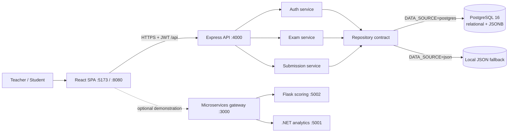
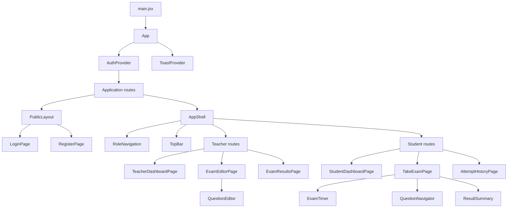
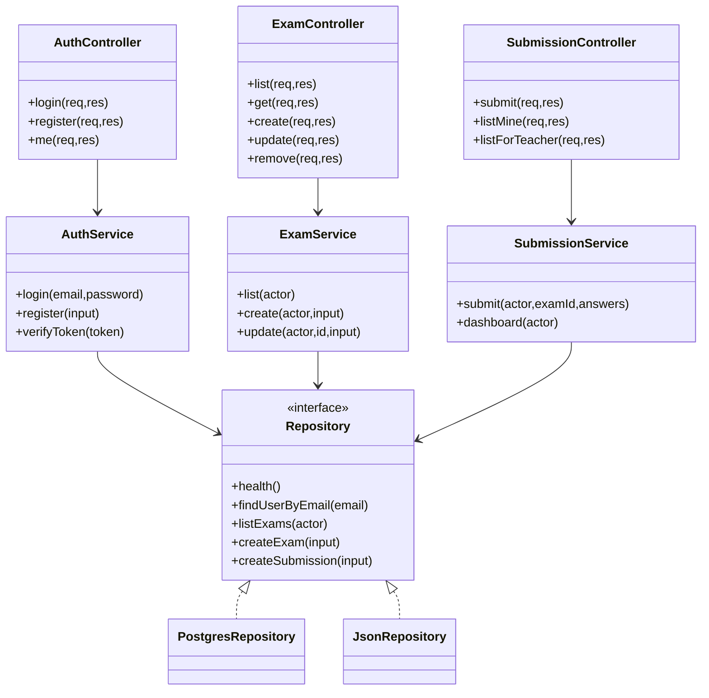
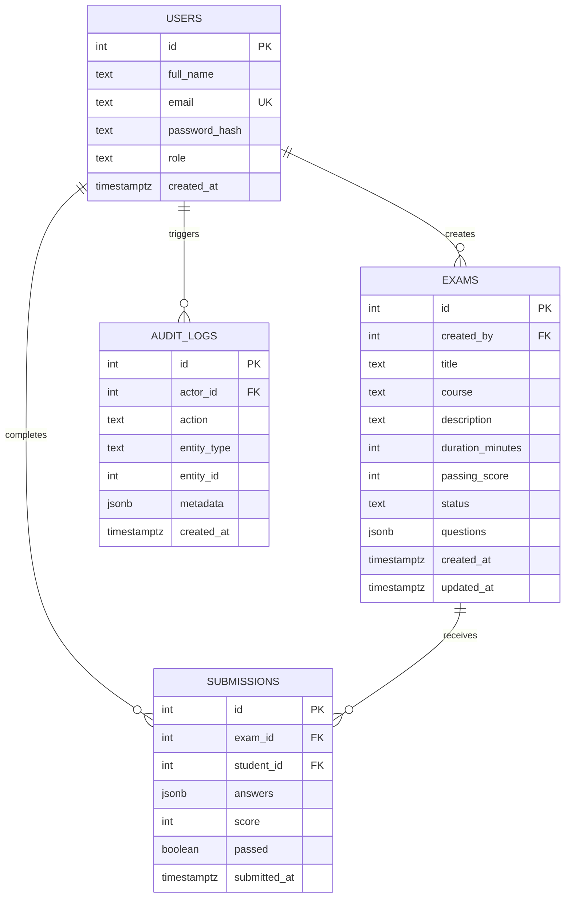
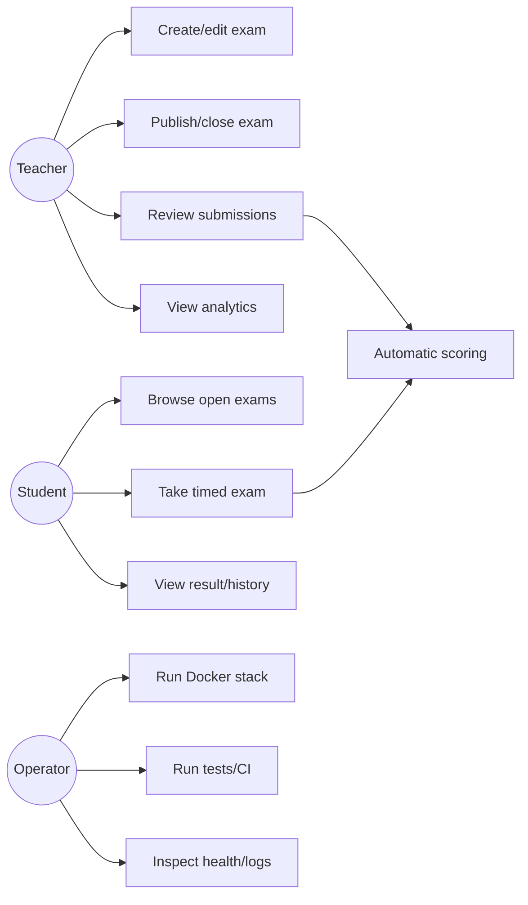
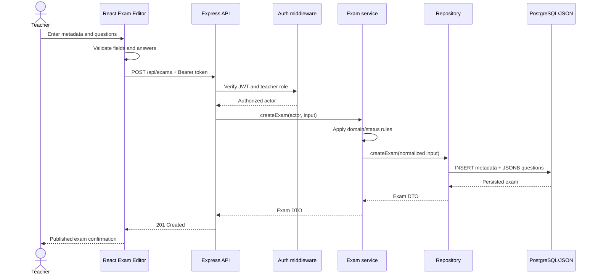
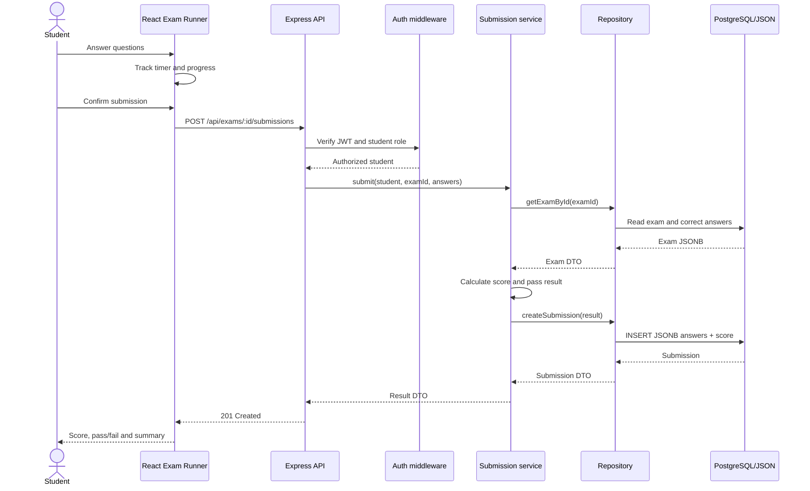
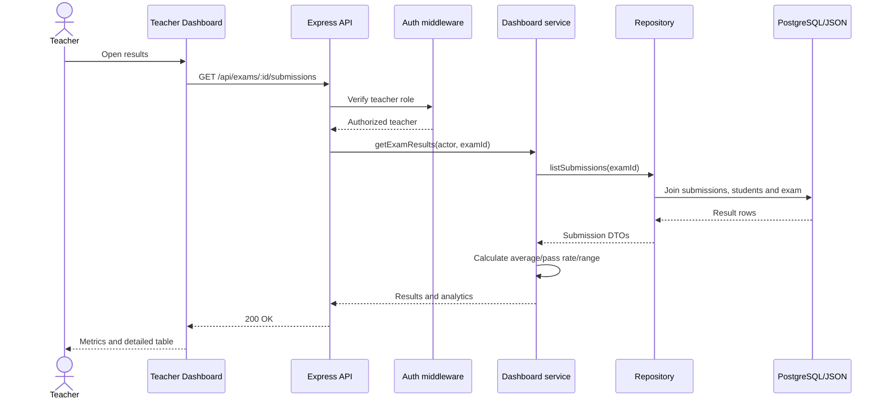
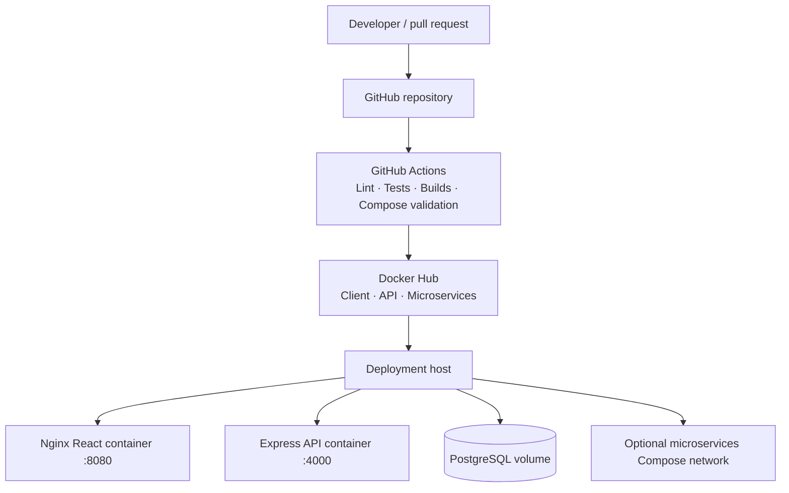

# Architecture and UML Diagrams

All diagrams use Mermaid so they render directly in GitHub and remain version-controlled with the implementation.

## 1. Overall architecture and data flow

## 2. React component hierarchy

## 3. Server UML/class diagram

## 4. Database ERD

## 5. Use-case diagram

## 6. Sequence: teacher creates and publishes an exam

## 7. Sequence: student submits an exam

## 8. Sequence: teacher reviews results

## 9. Deployment architecture

