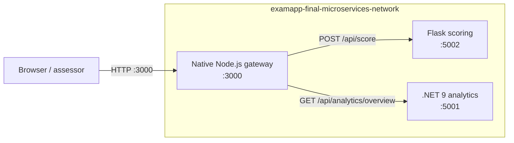

# ExamApp Microservices Track

This folder adds a self-contained, domain-specific microservices demonstration to ExamApp without coupling the main client or server to the demo.

- **Native Node.js gateway** — public browser dashboard and API on `:3000`
- **Python Flask scoring service** — score, grade, and pass/fail rules on `:5002`
- **.NET 9 analytics service** — exam performance summaries on `:5001`

The local path requires only Docker. Data is deterministic and no external API, database, account, or secret is needed.

## Architecture



See [docs/architecture.md](docs/architecture.md) for component, sequence, and deployment diagrams.

## Quick start

From `ExamApp-Final/microservices`:

```powershell
docker compose config --quiet
docker compose up --build --detach --wait
docker compose ps
powershell -ExecutionPolicy Bypass -File .\scripts\smoke-test.ps1
```

Open [http://localhost:3000](http://localhost:3000). The dashboard has buttons for health aggregation, Flask scoring, .NET analytics, and a concurrent end-to-end demonstration.

Stop everything cleanly:

```powershell
docker compose down --volumes --remove-orphans
```

## Service contract

| Service | Route | Behavior |
|---|---|---|
| Gateway | `GET /` | Browser demonstration dashboard |
| Gateway | `GET /health` | Gateway liveness |
| Gateway | `GET /api/services` | Aggregates downstream health; returns 503 if degraded |
| Gateway | `GET /api/score?correct=4&total=5&passingScore=60` | Validates query and proxies to Flask |
| Gateway | `GET /api/analytics` | Proxies to .NET overview |
| Gateway | `GET /api/demo` | Calls scoring and analytics concurrently |
| Scoring | `GET /health` | Flask liveness |
| Scoring | `POST /api/score` | Calculates percentage, letter grade, and pass/fail |
| Analytics | `GET /health` | .NET liveness |
| Analytics | `GET /api/analytics/overview` | Fixed five-attempt overview |
| Analytics | `POST /api/analytics/summary` | Validates and summarizes supplied scores |

Inside Docker, the gateway uses service DNS names:

```text
SCORING_SERVICE_URL=http://scoring-service:5002
ANALYTICS_SERVICE_URL=http://analytics-service:5001
```

It never uses `localhost` for container-to-container traffic.

## Expected demonstration values

```powershell
Invoke-RestMethod 'http://localhost:3000/api/services' | ConvertTo-Json -Depth 8
Invoke-RestMethod 'http://localhost:3000/api/score?correct=4&total=5&passingScore=60' | ConvertTo-Json -Depth 8
Invoke-RestMethod 'http://localhost:3000/api/analytics' | ConvertTo-Json -Depth 8
Invoke-RestMethod 'http://localhost:3000/api/demo' | ConvertTo-Json -Depth 10
```

- scoring: `80`, grade `B`, passed;
- analytics: five attempts, `74.8` average, `80` percent pass rate;
- service aggregation: gateway and both downstream services report `ok`.

Invalid query values, malformed JSON, out-of-range scores, wrong methods, missing routes, timeouts, and upstream failures produce structured JSON errors with appropriate HTTP status codes.

## Local tests

### Node gateway

```powershell
Push-Location .\gateway
npm run check
npm test
Pop-Location
```

The gateway has no runtime dependencies beyond Node 22.

### Flask scoring

```powershell
python -m venv .venv
.\.venv\Scripts\python -m pip install -r .\scoring-service\requirements.txt
Push-Location .\scoring-service
..\.venv\Scripts\python -m unittest discover -s . -p 'test_*.py' -v
Pop-Location
```

### .NET analytics

```powershell
dotnet restore .\analytics-service\AnalyticsService.csproj --configfile .\analytics-service\NuGet.Config
dotnet build .\analytics-service\AnalyticsService.csproj --configuration Release --no-restore --nologo
```

The Compose smoke test verifies the running .NET API and both network hops.

## Docker design

- Every service has its own Dockerfile and `.dockerignore`.
- Every runtime container uses a non-root user.
- Compose declares health checks and waits for healthy dependencies.
- All services share one explicitly named bridge network.
- Local Compose builds source; production Compose only pulls published images.
- No token, password, or `.env` file belongs in Git.

## Production Compose

Copy `.env.example` to `.env`, enter the public Docker Hub username, and choose `latest` or a published `sha-...` tag:

```powershell
Copy-Item .env.example .env
# Edit .env before continuing.
docker compose -f docker-compose.prod.yml config --quiet
docker compose -f docker-compose.prod.yml pull
docker compose -f docker-compose.prod.yml up --detach --wait
powershell -ExecutionPolicy Bypass -File .\scripts\smoke-test.ps1
docker compose -f docker-compose.prod.yml down
```

Expected images:

```text
<DOCKERHUB_USERNAME>/examapp-gateway:<IMAGE_TAG>
<DOCKERHUB_USERNAME>/examapp-scoring:<IMAGE_TAG>
<DOCKERHUB_USERNAME>/examapp-analytics:<IMAGE_TAG>
```

## CI/CD integration

Microservice validation is integrated into the repository's active
`.github/workflows/ci.yml` workflow. Image publishing for the gateway, scoring,
and analytics services is integrated into
`.github/workflows/docker-publish.yml` alongside the client and API images.
Publishing requires GitHub secrets `DOCKERHUB_USERNAME` and `DOCKERHUB_TOKEN`.

## Demo and troubleshooting

Use [docs/DEMO-GUIDE.md](docs/DEMO-GUIDE.md) for a concise recording sequence.

If a service is degraded:

```powershell
docker compose ps
docker compose logs gateway scoring-service analytics-service
```

If a required host port is occupied, stop the competing process rather than changing assignment ports `3000`, `5001`, or `5002`.
