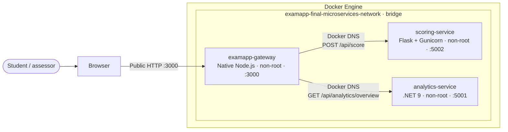
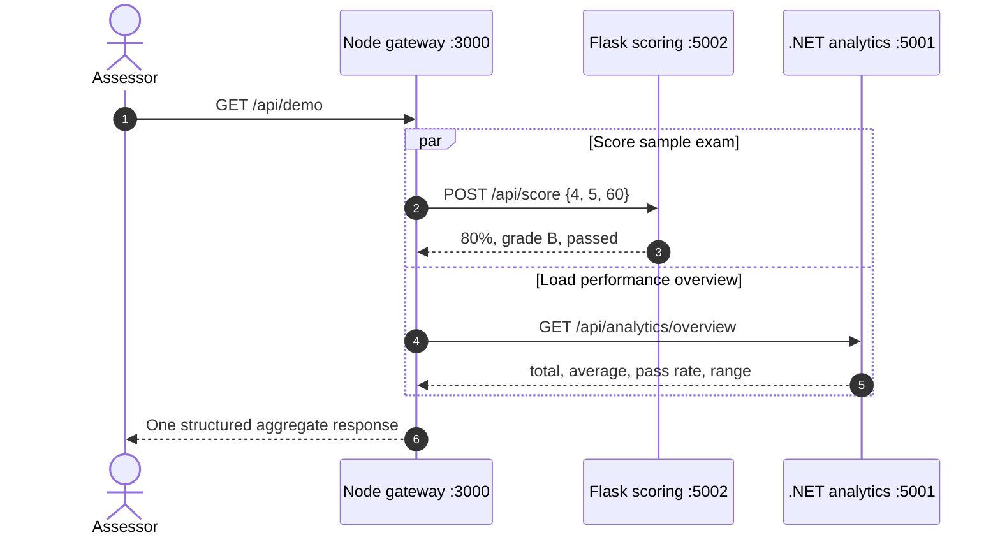
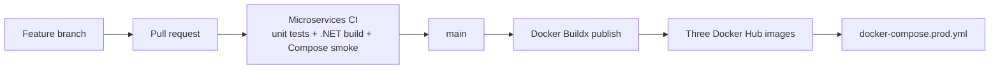

# Microservices architecture

## Runtime topology

Ports 5001 and 5002 are also published for transparent classroom inspection. Normal browser traffic enters through the gateway.

## Aggregate request

## Responsibility boundaries

| Component | Owns | Does not own |
|---|---|---|
| Gateway | Public routes, query validation, service discovery, timeouts, aggregation, dashboard | Scoring rules or analytics math |
| Scoring | Correct count, percentage, grade band, pass/fail | User accounts, persistence, analytics history |
| Analytics | Average, pass rate, highest/lowest score, attempt overview | Authentication, routing, answer correctness |

## Delivery path

